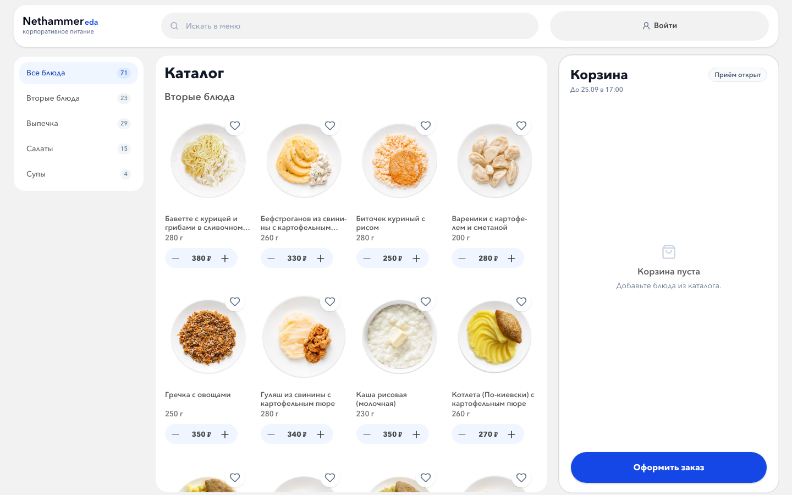
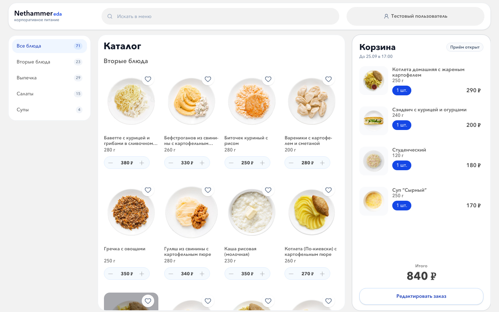
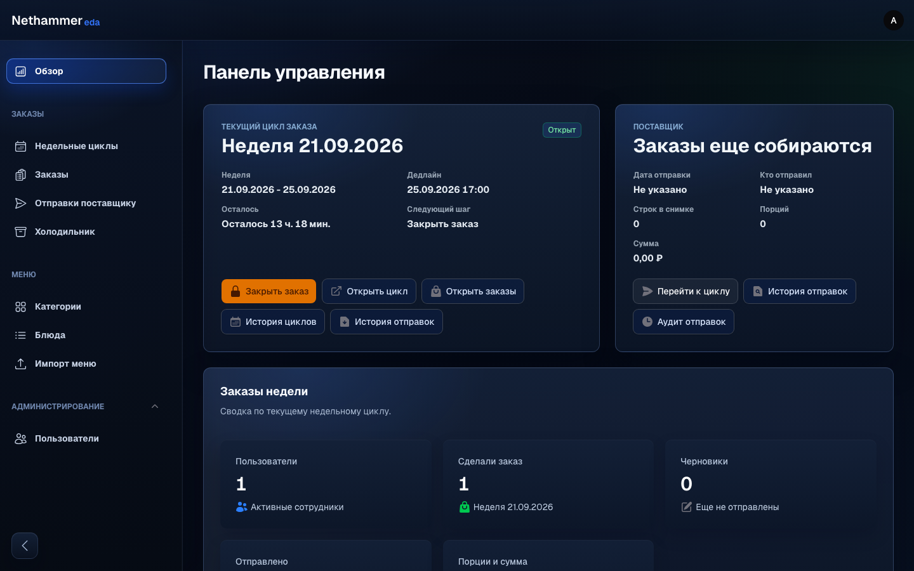

# Nethammereda

Corporate meal ordering for weekly cycles: a Vue catalog and cart for employees, a Laravel API, and a Filament dashboard for administrators. Orders can be tracked through delivery, exported for suppliers, and viewed in a personal fridge/history. Telegram login and WebApp support are optional integrations.

Сервис корпоративных обедов: сотрудники выбирают блюда на неделю, а администратор управляет циклами заказов, меню и выгрузками для поставщика. После доставки блюда отображаются в личном холодильнике.

## Screenshots / Скриншоты

All images below were captured from a fresh **local demo database** with fictional users; they are not mockups or production data.

| Catalog / Каталог | Submitted order / Заказ |
| --- | --- |
|  |  |



## Stack

Laravel 13 · PHP 8.3+ · Vue 3 · Vite · Tailwind CSS · Filament 5 · SQLite (local/hosted demo) / MySQL (other deployments). Tests: PHPUnit, Vitest.

## Interactive hosted demo / Интерактивное демо

**[Open the interactive demo](https://nethammereda-demo.onrender.com/)** · [Read-only admin viewer](https://nethammereda-demo.onrender.com/demo/admin)

The free Render demo runs the real Vue catalog and Laravel order API. Visitors can place disposable test orders in isolated accounts; the admin viewer shows only synthetic menu lists and a weekly-cycle overview. Admin changes, exports, and visitor data are inaccessible to the viewer. Data resets when the free instance sleeps/restarts; a cold start can take about a minute. Do not enter real personal information. No payment or Telegram integration is enabled. See [deployment instructions](docs/DEPLOYMENT.md).

**[Открыть интерактивное демо](https://nethammereda-demo.onrender.com/)** · [Админка только для просмотра](https://nethammereda-demo.onrender.com/demo/admin)

В бесплатном демо можно оформлять тестовые заказы в отдельных гостевых аккаунтах и просматривать вымышленное меню в админке без права изменений. После простоя данные сбрасываются, а запуск может занять около минуты. Не вводите персональные данные.

## Run locally / Локальный запуск

Requires PHP 8.3+ with SQLite, [Composer](https://getcomposer.org/), Node.js and npm. The commands below were checked on macOS with PHP 8.5 and Node.js 22. Use a **fresh clone and a new SQLite file**: `demo:reset` deletes existing demo menu, orders, cycles and fridge data. Do not run it against a database you want to keep.

```bash
git clone https://github.com/hattwell/nethammereda.git
cd nethammereda
composer install
npm ci
cp .env.example .env
```

In `.env`, keep `APP_ENV=local` and `DB_CONNECTION=sqlite`, set `APP_DEBUG=false`, and set `DB_DATABASE` to the **absolute path** of this clone's new `database/database.sqlite`. Leave Telegram credentials blank for the local demo. Then, from the repository root:

```bash
touch database/database.sqlite
php artisan key:generate
php artisan migrate --force
php artisan demo:reset --force
```

**Check the database path in `.env` before running the last command.** `demo:reset` is destructive and intended only for a throwaway local demo. The default `db:seed` does not load the demo.

Start the app and Vite in separate terminals (both on loopback):

```bash
php artisan serve --host=127.0.0.1 --port=8000
```

```bash
npm run dev -- --host 127.0.0.1 --port 5173
```

Open <http://127.0.0.1:8000/> for the catalog or <http://127.0.0.1:8000/admin/login> for the dashboard. Demo-only logins created by `demo:reset`:

| Role | Email | Password |
| --- | --- | --- |
| Employee | `user@lunch.local` | `password` |
| Admin | `admin@lunch.local` | `password` |

These accounts exist **only in the new local demo database**; never use these credentials on a deployed instance. The demo employee already has a submitted order, so the cart shows that order instead of an empty checkout.

## Tests

```bash
npm run build
php artisan test
npm test
```

Build before running PHP tests if the Vite dev server is not running: Filament views need the generated asset manifest. PHPUnit's config grants its isolated Filament test processes a 512 MB memory limit. The local demo, PHP and JavaScript tests, and the Vite build were checked with the commands above.

## Architecture

- Laravel API manages cycles, orders, fridge state, menu imports, and CSV/XLSX supplier exports.
- Vue provides the employee catalog and ordering UI; Filament provides the admin dashboard.
- Telegram Bot / WebApp integration is optional and needs separate credentials. It is not required for the local demo.

**Author:** Ivan · [hattwell](https://github.com/hattwell)
